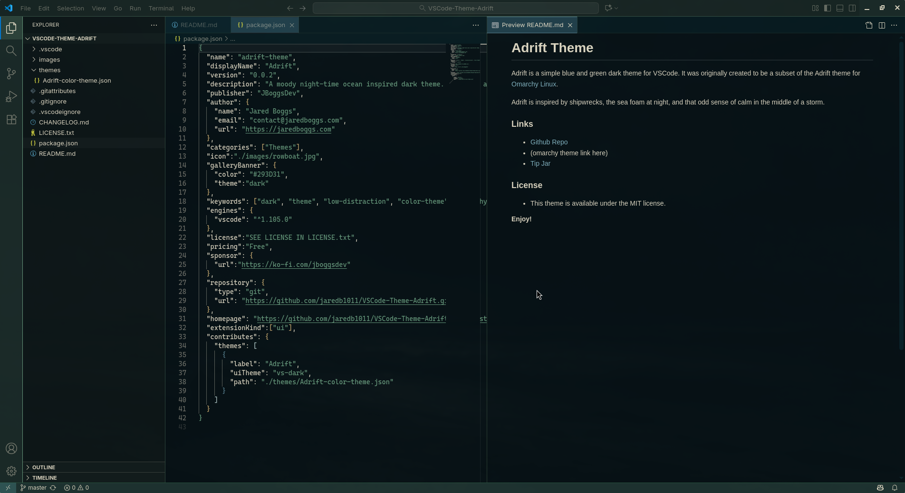
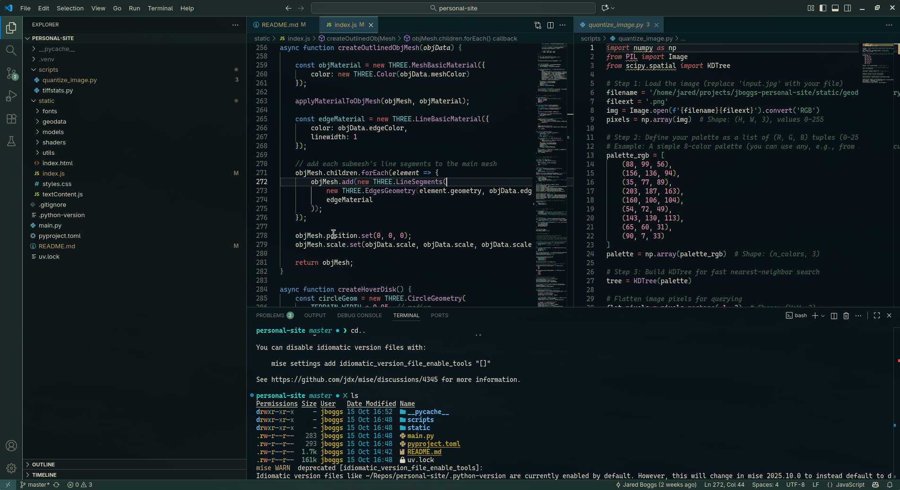

# Adrift Theme

Adrift is a simple blue and green dark theme for VSCode. It was originally created to be a subset of the Adrift theme for [Omarchy Linux](https://omarchy.org).

Adrift is inspired by shipwrecks, the sea foam at night, and that odd sense of calm in the middle of a storm.

### Links

* [Github Repo](https://github.com/jaredb1011/VSCode-Theme-Adrift)
* [Tip Jar](https://ko-fi.com/jboggsdev)

### License
* This theme is available under the MIT license.

**Enjoy!**
